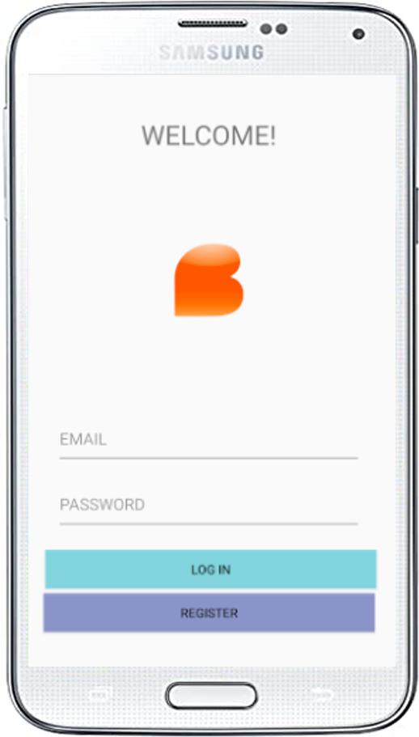
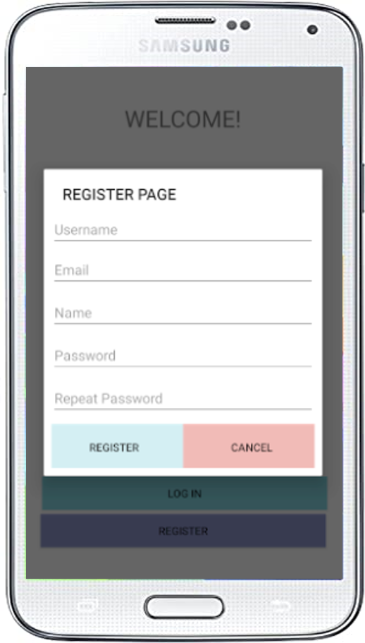
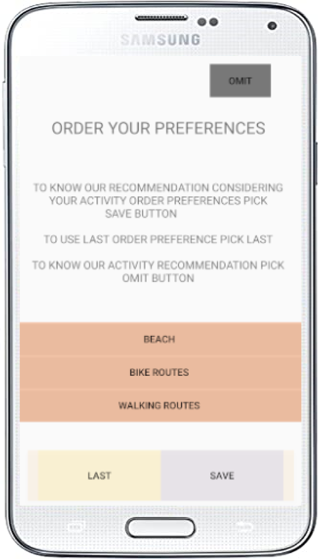
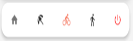
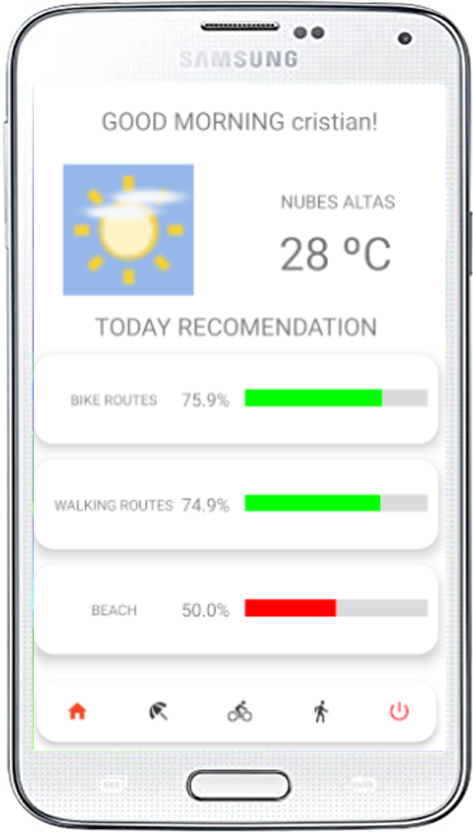
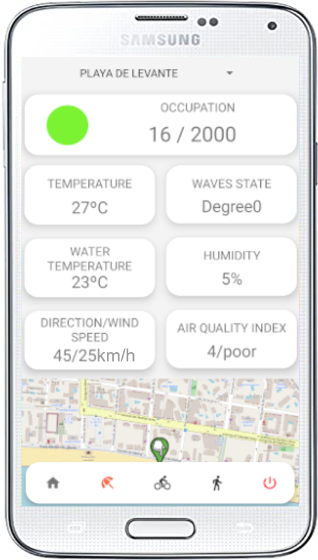
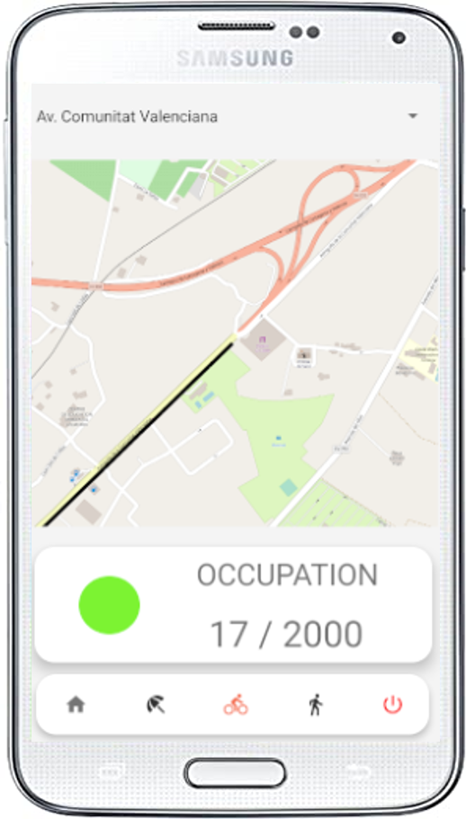
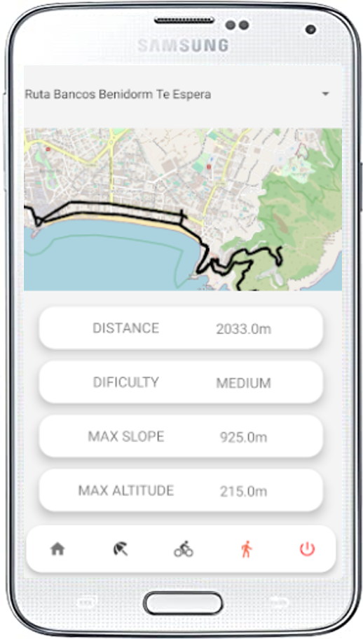
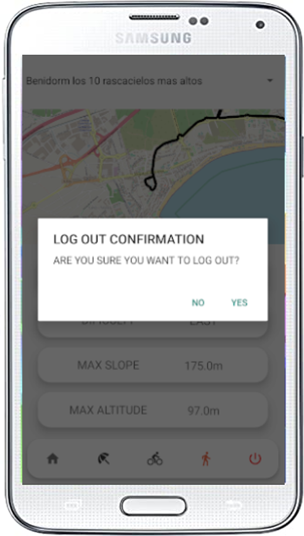

# User manual

The aim of this document is to create a **functional guide** to ensure the understanding of the Context Broker Healthy Leisure citizen app, so the users are able to exploit it to its fullest.

## Contents

- [Introduction](#introduction)
- [Screens](#screens)
  - [Login screen](#login-screen)
  - [Register screen](#register-screen)
  - [Preferences screen](#preferences-screen)
  - [menu bar](#main-menu-screen)
  - [Home screen](#home-screen)
  - [Beach screen](#beach-screen)
  - [Bike routes screen](#bike-routes-screen)
  - [Walking routes screen](#walking-routes-screen)
  - [Logout screen](#logout-screen) 

## Introduction

**Context Broker Healthy Leisure citizen app** is a mobile application oriented to healthy leisure in cities. The app consider user preferences to adjust the leisure recommendations based in algorithms. In addition, the app show real time data that the Context Broker Healthy Leisure web component gets from the sensors and devices deployed in the city.

[Top](#user-manual)

## Screens

### Login screen

In the login screen, you can insert our email and password and click the login button to access to the preferences screen.

>*Illustration 1. Login screen.*

[Top](#user-manual)

### Register screen

If you don't have an account in the app, you can register clicking on the Register button.

>*Illustration 2. Register screen.*

[Top](#user-manual)

### Preferences screen

In the preferences screen we have an explanation about what each button do. If we click the "OMIT" button, on the next screen we will see the recommendation which won't consider our preferences. If we click the "LAST" button on the next screen the system will take the last preferences configured. Finally if we click "SAVE" button on the next screen we will see the recommendation which will consider the preferences order you selected.

Finally, to order our preferences we have to hold down the preference we want to order and move to the position we want and when we have our preferences with the correct order, we will click the "SAVE" button.

>*Illustration 3. Preferences screen.*

[Top](#user-manual)

### Menu bar

To move between screens, you can use the menu bar.

- The house icon takes you to home screen.
- The umbrella icon takes you to beach screen.
- The bike icon takes you to bike routes screen.
- The person icon takes you to walking routes screen.

If we want to log out, click the on/off red icon.

>*Illustration 4. Menu Bar.*

[Top](#user-manual)

### Home screen

In the home screen, the first part show the weather state and the temperature. The second part show the recommendation result from the algorithm in the Context Broker Healthy Leisure web component (using or not de user preferences, depending the selected option in the preferences screen).

The results are displayed as a percentage and include a progress visual bar which indicates by colors if its more recommendable or less.

If we click on any of the recommendation cards we will go to each screen.

>*Illustration 5. Home screen.*

[Top](#user-manual)

### Beach screen

In the beach screen, the information of each beach is displayed. You can use the spinner to choose the beach that you want to see the information. The displayed information are:

- Actual occupation.
- Max occupation.
- Sensors data: temperature (in celsius scale), wave state indicator, water temperature (in celsius scale), humidity (percentage), wind direction, wind speed and Air Quality Index (AQI).
- Beach map.

>*Illustration 6. Beach screen.*

[Top](#user-manual)

### Bike routes screen

In the bike rourtes screen, the information of each bike route is displayed. You can use the spinner to choose the bike route that you want to see the information. The displayed information are:

- Actual occupation.
- Max occupation.
- Bike route map.

>*Illustration 7. Bike routes screen.*

[Top](#user-manual)

### Walking routes screen

In the walking routes screen, the information of each walking route is displayed. You can use the spinner to choose the wlaking route that you want to see the information. The displayed information are:

- Walking route map.
- Distance.
- Difficulty.
- Max slope.
- Max altitude.

>*Illustration 8. Walking routes screen.*

[Top](#user-manual)

### Logout screen

Finally if we want to log out we will click the on/off red button and we will see an alert that asks us if we want to log out. If we say "no", the alert will be closed and we will continue logged, but if we click "yes", we will be logged out of the app.

>*Illustration 9. Logout screen.*

[Top](#user-manual)