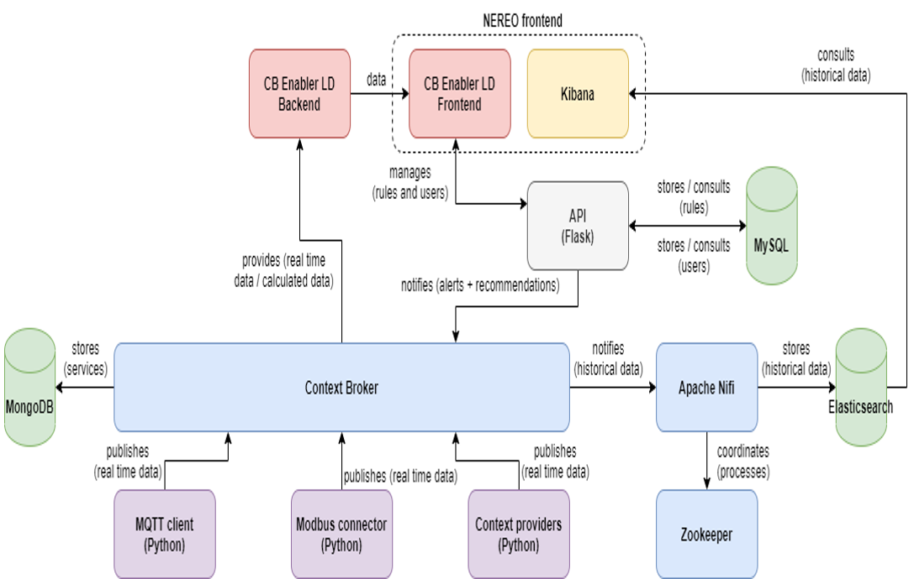

# Technical documentation

The technical documentation focuses in the technical aspects of the Context Broker Healthy Leisure, as well as it explains how to develop new features or how specific parts of the solution work.

## Content

- [Launch the application for development](#launch-the-application-for-development)
  - [Prerequisites](#prerequisites)
  - [Installation](#installation)
  - [Usage](#usage)
- [Architecture](#architecture)
  - [Context Broker](#context-broker)
  - [Apache Nifi](#apache-nifi)
  - [CB Enabler LD Backend](#CB-Enabler-LD-Backend)
  - [CB Enabler LD Frontend](#CB-Enabler-LD-Frontend)
  - [Kibana](#kibana)
  - [API](#api)
  - [MQTT connector](#mqtt-connector)
  - [Modbus connector](#modbus-connector)
- [Used technologies](#used-technologies)
- [Services](#services)
- [Understanding the code](#understanding-the-code)
  - [How to change the refresh time of the information](#how-to-change-the-refresh-time-of-the-information)
  - [How to change historical data dashboards](#how-to-change-historical-data-dashboards)
  - [How to change notifications dashboard](#how-to-change-notifications-dashboard)
  - [How to change polygon colors](#how-to-change-polygon-colors)
  - [How the information of the map is updated](#how-the-information-of-the-map-is-updated)
  - [Supported types of locations](#supported-types-of-locations)
  - [Supported types of subscriptions](#supported-types-of-subscriptions)
    - [Subscriptions for a specific ID with multiple attributes](#subscriptions-for-a-specific-id-with-multiple-attributes)
    - [Subscriptions for a group of entities of the same type with multiple attributes](#subscriptions-for-a-group-of-entities-of-the-same-type-with-multiple-attributes)
    - [Subscriptions for a group of entities with an idPattern with multiple attributes](#subscriptions-for-a-group-of-entities-with-an-idpattern-with-multiple-attributes)

### Launch the application for development

To use the application, it is recommended to follow the [deployment manuals](../tutorials/index.md). However, to launch the application for development purposes, follow these instructions.

#### Prerequisites

- Local environment (Windows or Linux), cloud environment (Windows or Linux) or FIWARE Sandbox
- [Git](https://git-scm.com/downloads)
- [Docker](https://www.docker.com/)
- [Docker Compose](https://docs.docker.com/compose/)

#### Installation

Execute the following commands (valid for Windows and Linux):

```bash
git clone https://github.com/ConnectingEurope/Context-Broker-Healthy-Leisure.git
```

#### Usage

To launch the application, execute the following command:

##### Windows

```bash
deploy_windows.bat
```

##### Linux

```bash
sh deploy_linux.sh
```

Then, access to the application here: [localhost:4200](localhost:4200) or in cloud [your_public_ip](http://your_public_ip)

### Architecture

The following image represents the architecture of the Context Broker Healthy Leisure and its integration with the rest of the tools:



> *Illustration 1. Architecture of the Context Broker Healthy Leisure*

It is recommended to read the links of the [Reference documentation](../../../README.md#reference-documentation) section before continuing reading the rest of this documentation.

Hereunder, the most relevant set of tools of the architecture are going to be detailed:

#### Context Broker 

The Context Broker is responsible of providing real-time data to all de components. The most recent information is stored in the Elasticsearch using Apache Nifi. Context Broker uses the LD version.

More information of the Context Broker LD can be found [here](https://github.com/FIWARE/context.Orion-LD).

[Top](#technical-documentation)

#### Apache Nifi

Apache Nifi stores all the data that the Context Broker provides in Elasticsearch. Nifi transforms the data coming from Context Broker so that it can be ingested into Elasticsearch respecting NGSI LD.

More information of Apache Nifi can be found [here](https://nifi.apache.org/).

[Top](#technical-documentation)

#### CB Enabler LD Backend

The Back-end of the Context Broker Data Visualisation enabler is a NodeJS module that acts as the server of the Front-end of the Data Visualisation. It is adapted to accept the NGSI LD format.

It is responsible of sending all the requests to the Context Broker, managing all the data of the Data Visualisation enabler.

It also stores the configuration of the Configuration page in an internal JSON file called configuration.

[Top](#technical-documentation)

#### CB Enabler LD Frontend

The Front-end of the Data Visualisation enabler consists on the visualization layer. It contains all the views of the enabler (map, configuration, historical data, etc.) and requests all the information to be displayed directly to the Backend. It is adapted to accept the NGSI LD format.

[Top](#technical-documentation)

#### Kibana

Kibana is the tool used to visualize historical data and generate added value to all the data using its Business Intelligence engine.

More information of Kibana can be found [here](https://www.elastic.co/es/kibana).

[Top](#technical-documentation)

#### API

The API includes the rule engine. It's based on [Flask](https://flask.palletsprojects.com/en/2.0.x/), a Python framework for web development. In addition, it also includes some methods for user management and obtaining external data.

[Top](#technical-documentation)

#### MQTT connector

The MQTT connector is used to get the data from the LoRa platform. This component is developed in Python.

[Top](#technical-documentation)

#### Modbus connector

The Modbus connector is used to get the data from the devices connected to a PLC. This component is developed in Python.

[Top](#technical-documentation)

### Used technologies

The following technologies have been used for the development and the deployment of the Context Broker Healthy Leisure:

- [Angular](https://angular.io/)
- [OpenStreetMap](https://www.openstreetmap.org/)
- [Leaflet](https://leafletjs.com/)
- [NodeJS](https://nodejs.org/)
- [MongoDB](https://www.mongodb.com/)
- [Docker](https://www.docker.com/)
- [GitHub](https://github.com/)
- [Orion Context Broker](https://github.com/telefonicaid/fiware-orion)
- [FIWARE lab](https://www.fiware.org/developers/fiware-lab/)
- [Markdown](https://www.markdownguide.org/)
- [Python](https://www.python.org/)
- [Elasticsearch](https://www.elastic.co/es/)
- [Kibana](https://www.elastic.co/es/kibana)
- [Apache Nifi](https://nifi.apache.org/)
- [Apache ZooKeeper](https://zookeeper.apache.org/)
- [MySQL](https://www.mysql.com/)


[Top](#technical-documentation)

### Services

The following services have been created for the Context Broker Healthy Leisure, service name (service path):

- **weatherobservedaemet (/weatherobservedaemet):** this service uses the WeatherObserved data model and it is used for colleting the data from the open data source, related to the weather.
- **walkingroutes (/walkingroutes):** this service uses the WalkingRoutes data model and it is used for the information related to the wlking routes.
- **seaconditions (/seaconditions):** this service uses the SeaConditions data model and it is used for the data from the open data source, related to the sea.
- **bikelaneconditions (/bikelaneconditions):** this service uses the BikeLane data model and it is used for the information related to the bike lanes.
- **beachconditions (/beachconditions):** this service uses the Beach data model and it is for the data from the sensors on the beach.
- **airqualityobserved (/airqualityobserved):** this service uses the AirQualityObserved data model and it is used for the sensors related to the weather and the air quality installed arround the city.
- **airqualityobservedairquality (/airqualityobservedairquality):** this service uses the AirQualityObserved data model and it is used for the sensors related to the weather and the air quality installed on the the beach.
- **alerts (/alerts):** this service uses the Alert data model and it is used for the alerts and notifications.

[Top](#technical-documentation)

### Understanding the code

The objective of this section is to explain different technical aspects of the Context Broker Healthy Leisure, including new developments, modifying parts of the Context Broker Healthy Leisure, etc.

[Top](#technical-documentation)

#### How to change the refresh time of the information

By default, the refresh time of the real-time data in the map is 1 minute. In milliseconds, it is 60000.

This refresh time can be changed, modifying a the value of a variable in the map-dashboard.component.ts.

```typescript
    private intervalRefreshMilliseconds: number = 60000;
```

In this case, the value of the *intervalRefreshMilliseconds* variable (60000) can be replaced by the desired refresh time (in milliseconds).

[Top](#technical-documentation)

### How to change historical data dashboards

The dashboards of the Context Broker Healthy Leisure are generated using [Kibana](https://www.elastic.co/es/kibana).

The following steps explain how to change the current kibana dashboards to another dashboard.
 1. Open the **historical-dashboard.component.ts** and **historical-dashboard.component.html** files.
 2. In the **historical-dashboard.component.ts**, there are the different links to each dashboard which will be replaced with the desired URL dashboard and a variable used to switch between dashboards:

```typescript
public firstDashboard: any ="http://link-to-first-dashboard.com";
public secondDashboard: any ="http://link-to-second-dashboard.com";
public dashboardRef: any;
```

 3. The name of the variable should be replaced as well with a descripting name.
 4. It needs a sanitiizer to enable the URL as a secure source and a default dashboard to be displayed:
 
 ```typescript
    constructor(private sanitizer: DomSanitizer){
    this.dashboardRef = this.sanitizer.bypassSecurityTrustResourceUrl(this.firstDashboard);
    }
 ```

 5. Once all the different links has been changed, we will need to change the switch that acts as a orchestrator to get the proper dashboard link:
 
 ```typescrypt
 public changeDashboard(dashboard: string): void{
  swtich(dashboard){
    case 'first':
      this.dashboardRef = this.sanitizer.bypassSecurityTrustResourceUrl(this.firstDashboard);
      break;
    case 'second':
      this.dashboardRef = this.sanitizer.bypassSecurityTrustResourceUrl(this.secondDashboard);
      break;
  }
 }
 ```

 6. In the **historical-dashboard.component.html**, add the needed buttons by copying the existing one and change the name and the string passed to the function:
 
 ```html
<button class="btn text-white mx-1 col-12 col-auto float-right" (click)="changeDashboard('first')">First dashboard</button>
<button class="btn text-white mx-1 col-12 col-auto float-right" (click)="changeDashboard('second')">Second dashboard</button>
```

7. The new dashboards will be displayed if the links are properly set. 

[Top](#technical-documentation)

### How to change notifications dashboard

The dashboards of the Context Broker Healthy Leisure are generated using [Kibana](https://www.elastic.co/es/kibana).

The following steps explain how to change the current notifications dashboard:
1. Open the **notifications.component.ts** file.
2. In the **notifications.component.ts**, there is a notifications link to the dashboard:

```typescript
public notifications: any ="http://link-to-notifications-dashboard.com";
public dashboardRef: any;
```

3. As in the previous [How to point](#how-to-change-historical-data-dashboards), it needs a sanitiizer to enable the URL as a secure source and a default dashboard to be displayed:

```typescript
    constructor(private sanitizer: DomSanitizer){
    this.dashboardRef = this.sanitizer.bypassSecurityTrustResourceUrl(this.notifications);
    }
 ```

4. The new notifications dashboard will be changed and it will be shown if the dashboard is compatible with the html iframe tag.

[Top](#technical-documentation)

#### How the information of the map is updated

In order to optimize the load and update of the information of the map, it is updated based on the following actions:

- For the first load of information (after completing the configuration on the Configuration page), all the sensors are situated on the map. Additionally, the loaded attributes are:
  - ID
  - Type
  - Location
  - Main attribute. More information can be found [here](../user/index.md#configuring-main-attributes).

- Once the initial load of information is completed, the previous attributes are updated every 60 seconds by default. This action allows to visualize sensors whose location is changing during the time (i.e. buses).

- The rest of attributes are updated when the user clicks on a sensor, showing the visualization panel.

- Additionally, when a filter is added, the values for the selected attributes as filters are also automatically updated every 60 seconds by default.

The previous procedure optimizes the load of information and allows to manage high amounts of information in the Context Broker Healthy Leisure, avoiding efficiency problems.

[Top](#technical-documentation)

#### Supported types of locations

The supported types of locations of the sensors are [GeoJSON](https://geojson.org/).

This is an example:

```json
"location": {
    "type": "geo:json",
    "value": {
        "type": "Point",
        "coordinates": [-3.712247222222222, 40.423852777777775]
    }
},
```

The **location** attribute of the sensors has to follow the previous schema. The type of the coordinates has to be **Point** or **Polygon**, and its value has to be a **list of two coordinates**. Otherwise, the sensors won't be supported in the Context Broker Healthy Leisure (i.e. LineString).

[Top](#technical-documentation)

#### Supported types of subscriptions

With the objective of generating historical data, Apache Nifi is subscribed to the Context Broker. Then, when the Context Broker receives new data and, if this data matches with the configuration of the subscription, it is sent to Apache Nifi (and stored in Elasticsearch).

There are some examples for subscriptions in this [link](https://www.postman.com/fiware/workspace/fiware-foundation-ev-s-public-workspace/collection/513743-41c2de83-48e2-46bb-9073-2a9fbe4fc5c3?ctx=documentation).

In relation with the subscriptions, there are lots of possibilities to configure them. Depending on the IDs of the entities, their attributes, the conditions for the notification, etc.

For the Context Broker Healthy Leisure, the **supported subscriptions** is:

##### Subscriptions for a specific ID with multiple attributes

This type of subscription is focused on the entity whose ID is the same as the one indicated in the request. Concretely, in the **id** key.

All the desired attributes to be subscribed for the specific entity, need to be included in the **notification -> attrs list**.

This is the structure of the request for this kind of subscription:

**URL:** <http://your_ip:1026/ngsi-ld/v1/subscriptions/>

```json
{
  "description": "Notify Elasticsearch the changes of the attributes for the entity ENTITY_ID_1",
  "subject": {
    "entities": [
      {
        "id": "ENTITY_ID_1",
        "type": "TYPE_OF_THE_ENTITY"
      }
    ],
    "condition": {
      "attrs": []
    }
  },
  "notification": {
    "http": {
      "url": "http://example.com/notify"
    },
    "attrs": [
      "ATTRIBUTE_1",
      "ATTRIBUTE_2",
      "ATTRIBUTE_N"
    ]
  }
}
```
[Top](#technical-documentation)